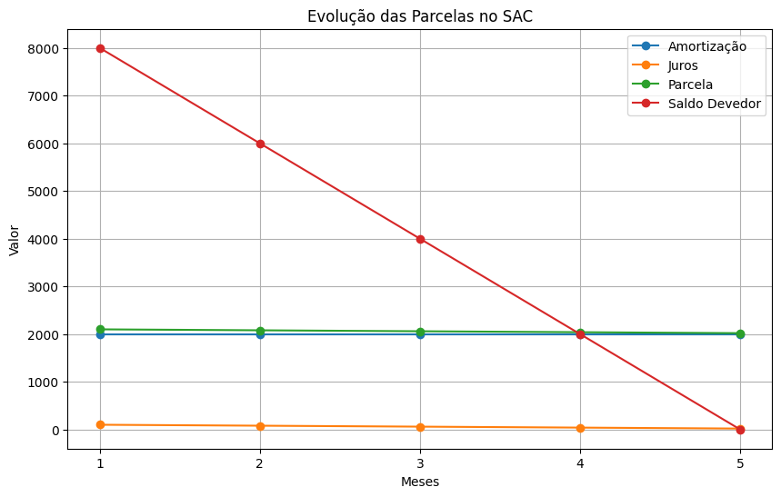
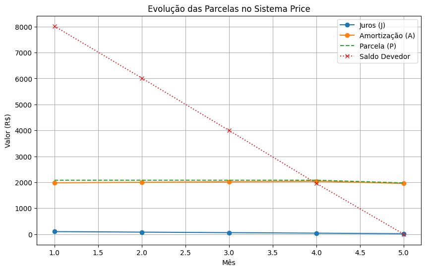

# Trabalho sobre Sistemas de Amortização de Empréstimos

**Aluno**: Mauricio Benjamin da Rocha

## 1. Introdução

**PRICE** (Parcelas Iguais com Juros)

O sistema de amortização contém todas as informações sobre as formas de pagamento e prazo de quitação da dívida. Por meio dele, é definido o número de parcelas para o pagamento do saldo devedor, o valor de cada prestação e como a dívida será liquidada ao longo do contrato.

Existem diversos sistemas de amortização diferentes. Um dos mais utilizados para amortizar dívidas é a Tabela Price, também conhecida como Sistema Francês de Pagamentos. Neste modelo, o pagamento é feito a partir de um conjunto de prestações fixas de mesmo valor. As parcelas são pagas sucessivamente em valores constantes, já com os juros embutidos no valor de cada prestação.

Como as parcelas são constantes, o montante total é amortizado de forma crescente ao longo do contrato. Ou seja, a cada prestação o saldo da dívida é reduzido em volume maior, até que a dívida seja quitada.

A principal vantagem do sistema de amortização Tabela Price são as prestações fixas. Como o valor a ser pago mensalmente não corre o risco de sofrer reajustes, o planejamento financeiro associado à dívida é sólido, sem as surpresas de inflação e crises financeiras. Operações com Tabela Price costumam se destinar àqueles que procuram garantir estabilidade no orçamento.

**SAC** (Sistema de Amortização Constante)

Outro sistema de pagamentos muito utilizado é o Sistema de Amortização Constante (SAC),  onde o pagamento é feito a partir de prestações decrescentes.

Como o próprio nome diz, o valor da dívida é amortizado de modo constante em todos os períodos.  Isto é: as parcelas ficam cada vez menores, na medida em que o saldo devedor diminui em mesmo volume a cada prestação.

A principal vantagem do SAC é que a maior parte da dívida é quitada no início do prazo para pagamento. Fica garantido, assim, maior folga orçamentária a longo prazo, ao fim da dívida. Por isso, recomenda-se o SAC para contratos de empréstimos mais longos.

## 2. Funcionamento dos Diferentes Sistemas

Antes de captar crédito, lembre-se das vantagens e desvantagens de cada um dos principais sistemas de amortização das dívidas. É por meio deles que é definido o impacto da dívida sobre o orçamento do seu negócio durante os meses do contrato.

### 2.1 SAC (Sistema de Amortização Constante)

No SAC, a amortização do capital é constante ao longo do tempo, enquanto os juros diminuem conforme a dívida é paga. Como resultado, as parcelas iniciais são mais altas e vão reduzindo ao longo do tempo.

**Fórmulas:**

- **Amortização**: A = P / N

- **Juros**: K = S * i

- **Parcela**: Pn = A + Jn

Onde:

- \( P \) = valor total do empréstimo
- \( N \) = número de parcelas
- \( S \) = saldo devedor
- \( i \) = taxa de juros por período

### 2.2 Sistema Price (Parcelas Iguais com Juros)

No Sistema Price, o valor das parcelas é fixo ao longo do tempo. Inicialmente, a maior parte da parcela corresponde aos juros, enquanto a amortização aumenta com o tempo.

**Fórmula da parcela fixa:** P = (P * i) / (1 - (1 + i)**-n)

Onde:

- \( P \) = valor total do empréstimo
- \( i \) = taxa de juros por período
- \( N \) = número de parcelas

## 3. Exemplos de Cálculo

### Exemplo 1: SAC

Considere um empréstimo de R$ 10.000,00 a uma taxa de juros de 1% ao mês, pago em 5 meses. Conforme mostrado na Tabela 1 e Figura 1.

<strong>Tabela 1</strong>: Evolução das Parcelas no SAC

| Mês | Amortização (A) | Juros (J) | Parcela (P) | Saldo Devedor |
|------|----------------|------------|-------------|---------------|
| 1    | 2.000,00       | 100,00     | 2.100,00    | 8.000,00      |
| 2    | 2.000,00       | 80,00      | 2.080,00    | 6.000,00      |
| 3    | 2.000,00       | 60,00      | 2.060,00    | 4.000,00      |
| 4    | 2.000,00       | 40,00      | 2.040,00    | 2.000,00      |
| 5    | 2.000,00       | 20,00      | 2.020,00    | 0,00          |

<strong>Figura 1</strong>: Evolução das Parcelas no SAC, dado as métricas apresentadas na Tabela 1

Tanto a Tabela 1 quanto a Figura 1 apresentam a queda do valor dos juros em cada parcela, comprovando que os juros diminuem conforme a dívida é paga. Como resultado, as parcelas iniciais são mais altas e vão reduzindo ao longo do tempo. Se possível, sempre tente pagar algumas parcelas iniciais para que as próximas sejam menores e você consiga se livrar logo da dívida.

### Exemplo 2: Sistema PRICE

Para o mesmo empréstimo de R$ 10.000,00 a 1% ao mês em 5 meses:

Cálculo da parcela fixa: P = (10000 * 0.01) / (1 - (1 + 0.01) ** -5)

<strong>Tabela 2</strong>: Evolução das Parcelas no PRICE

| Mês | Juros (J) | Amortização (A) | Parcela (P) | Saldo Devedor |
|------|------------|----------------|-------------|---------------|
| 1    | R$ 100,00     | R$ 1981,00        | R$ 2081.00   | R$ 8019.00      |
| 2    |R$  80,19      | R$ 2.000,81       | R$ 2081.00   | R$ 6018.19      |
| 3    |R$  60,18      | R$ 2020,82        | R$ 2081.00   | R$ 3997.37      |
| 4    | R$ 39,87      | R$ 2041,03        | R$ 2081.00   | R$ 1956.34      |
| 5    | R$ 19,56      | R$  1956,34        | R$ 1975.90   | R$ 0,00          |

    <strong>Figura 2</strong>: Evolução das Parcelas no Sistema PRICE

**Obs**: No Sistema Price, o valor das parcelas é fixo ao longo do tempo. Inicialmente, a maior parte da parcela corresponde aos juros, enquanto a amortização aumenta com o tempo. Na última parcela, forçamos a amortização ser igual ao saldo devedor restante, isso é comum em sistemas bancários reais, pois garante que o saldo final seja exatamente zero.

## 4. Conclusão

- O **SAC** é vantajoso para quem deseja pagar menos juros no total, pois as parcelas diminuem ao longo do tempo.
- O **Sistema Price** é melhor para quem precisa de parcelas fixas e previsíveis.
- A escolha do sistema de amortização depende do perfil financeiro do tomador do empréstimo. Eu particularmente prefiro abater logo os valores visando encerrar a dívida e ter juros menores (ou nenhum).

## 5. Referências

- [SAC OU PRICE: entenda a diferença entre as amortizações](https://blog.capitalempreendedor.com.br/tabela-price-ou-sac-2025/?utm_term=&utm_campaign=pmaxutm_content=pmax&utm_source=adwords&utm_medium=ppc&hsa_acc=1464082127&hsa_cam=21335218480&hsa_grp=&hsa_ad=&hsa_src=x&hsa_tgt=&hsa_kw=&hsa_mt=&hsa_net=adwords&hsa_ver=3&gad_source=1&gclid=CjwKCAjwwLO_BhB2EiwAx2e-39Vo8AunUHk5HTYBWWzxmo6eSTsuPtm8PCDZpHBwppNeeF6HTnR8whoCx3IQAvD_BwE)
- [SAC ou Price: qual a melhor forma de amortizar as parcelas do financiamento](https://www.creditas.com/exponencial/sac-ou-price/)
- [Material de Apoio com Python usando nos cálculos](https://github.com/mauriciobenjamin700/9-periodo/blob/main/mf/markdown/homework-2.ipynb)
